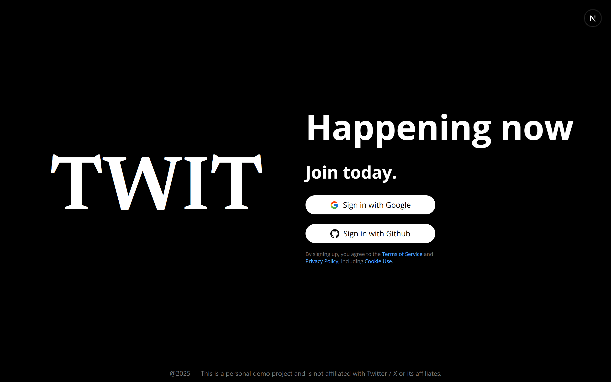
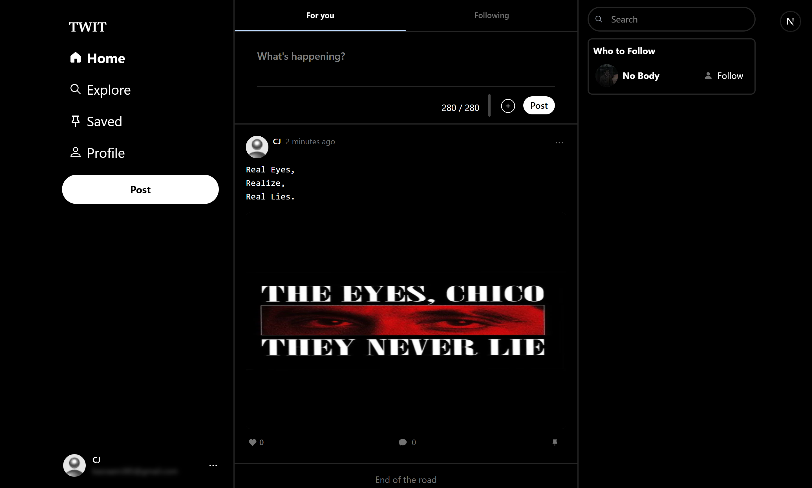

# Twit Clone

A modern, full-stack Twitter clone built with Next.js 15, TypeScript, MongoDB, and Tailwind CSS. This project demonstrates scalable architecture, advanced React patterns, and production-ready features for a social media platform.

## Features

- **Authentication:** Secure login with NextAuth.js

- **User Profiles:** Editable profiles, cover images, and avatars

- **Posts:** Create, delete, like, save, and report posts

- **Comments:** Add and delete comments on posts

- **Follow System:** Follow/unfollow users, see followers/following

- **Feed:** Personalized home feed and explore trending posts

- **Notifications:** Real-time updates for likes, comments, and follows

- **Search:** Find users and posts instantly

- **Cloudinary Integration:** Image uploads and optimization

- **State Management:** Zustand for global user state

- **Responsive UI:** Mobile-first, accessible, and fast

- **React Hot Toast:** User feedback for all server actions

- **SEO:** Dynamic metadata for all pages

## Tech Stack

- **Frontend:** Next.js 15 (App Router), React, TypeScript, Tailwind CSS

- **Backend:** Next.js API routes, MongoDB (Mongoose), Cloudinary

- **Auth:** NextAuth.js

- **State:** Zustand

- **Notifications & Toasts:** react-hot-toast

## Project Structure

```

src/

actions/ # Server actions for posts, comments, likes, etc.

app/ # App Router pages and layouts

components/ # Reusable UI and feature components

lib/ # Utility libraries (db, cloudinary, etc.)

models/ # Mongoose models

types/ # TypeScript types

zustand/ # Zustand store

public/ # Static assets

```

## Getting Started

1.  **Clone the repo:**

```bash

git clone https://github.com/yourusername/twit-clone.git

cd twit-clone

```

2.  **Install dependencies:**

```bash

npm install

```

3.  **Set up environment variables:**

- Create a `.env.local` file:

```env

MONGODB_URI=your_mongodb_connection_string

AUTH_SECRET=your_nextauth_secret

AUTH_GITHUB_ID=your_github_id
AUTH_GITHUB_SECRET=your_github_secret

AUTH_GOOGLE_ID=your_google_id
AUTH_GOOGLE_SECRET=your_google_secret

CLOUDINARY_CLOUD_NAME=your_cloud_name
CLOUDINARY_API_KEY=your_api_key
CLOUDINARY_API_SECRET=your_api_secret

NEXT_PUBLIC_API_BASE_URL=your_domain

```

4.  **Run locally:**

```bash

npm run dev

```

5.  **Deploy:**

- Deploy to Vercel for best results. Set environment variables in the Vercel dashboard.

## Senior Engineering Highlights

- **Type Safety:** Strict TypeScript throughout the stack

- **Server Actions:** Modern Next.js server actions for data mutations

- **Optimized Fetching:** Uses cache strategies and revalidation for performance

- **Error Handling:** User-friendly error boundaries and toast notifications

- **Scalable Structure:** Modular, maintainable codebase for growth

- **Security:** Follows best practices for authentication and data validation

- **Accessibility:** Semantic HTML and accessible UI components

## Screenshots

### Login Page



### Home Page



---

**Built by a Junior engineer for portfolio and learning purposes.**
